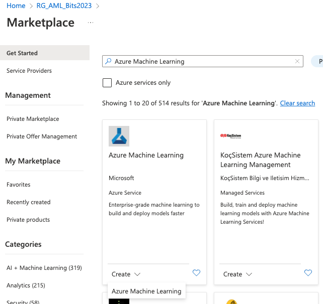
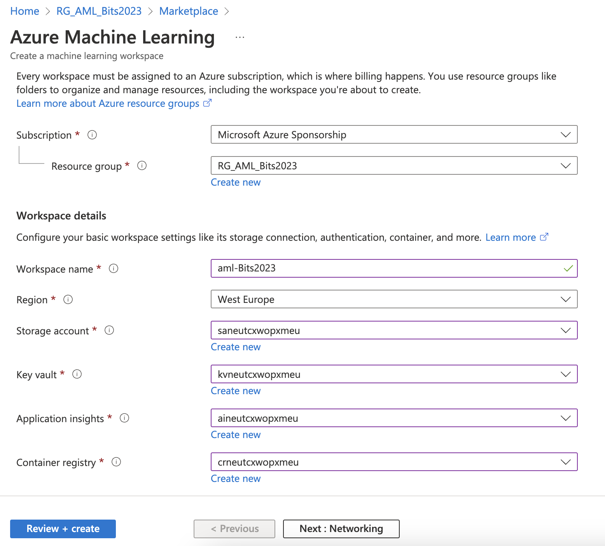

# Applied Data Science with Azure Machine Learning in a day

## Module 2

Module 2 - **Create, and manage your workspace, data, and compute for your experiments** will be focusing on:

- creating, configuring and managing your Azure Machine Learning workspace 
- attaching data from the Azure Storage Account we created in the previous module
- registering datastores and creating datasets
- exploring and configuring compute assets that optimally fit the training workload.

## Breakdown of Module

1. Log into Azure Portal
2. Create Azure Machine Learning Workspace
3. Manage your workspace
5. Adding data to your workspace
6. Adding compute to experiments

## Login into Azure Portal

Go to URL https://portal.azure.com and login if you already have an Azure account. If you don't already have and account you can sign-up for a free account at https://azure.microsoft.com/en-in/free/.

## Creating workspaces

Navigate to the `RG_AML_Bits2023` Resource Group and select the `Create` option after opening the Resource Group.

Inside the Marketplace search for `Azure Machine Learning` and click on the `Create - Azure Machine Learning` option after selecting the Azure Machine Learning tile.

Make sure the correct subscription and Resource Group is selected and provide the Workspace details.
The most important detail is the `Workspace name` which - as you would expect - set the name of the workspace.
All of the other required settings can be configured to use the resources we created using the Bicep template in module 1.

The figure below shows an example configuration. The names of the various services can be different in your situation.

Click `Next: Networking`. 
Under network, I will set it to "Enable public access from all networks" but you can do the opposite, based on your policies. You can always do the opposite and close all public access and open it later. It is not baked into the workspace. You will also want to later check the Networking settings of your workspace when setting up the "private endpoint connections" (in this case you will also have to provide the instance details, virtual network, DNS, and interface details).

Click `Next: Advanced`. 
Advanced settings will will mostly depend on your working environment and how you want to access data. If it is for personal use you can leave the defaults on, if you are working within an organization it is imperative to set the advanced parameters correctly. So let's learn what they do:

`Managed identity`: if you are working within an organization, the "user-assigned identity" will be the type you want to select, otherwise, you can select the system-assigned identity. 

`Storage account access`: Datastores with underlying storage access normally use credential-based access. Connection information (like token authorization, subscription ID, and tenant ID) is stored in the key vault that is associated with the workspace (and was defined in a previous step). When you select identity-based access for the storage account, the user's azure account (ADF directory token) is used to confirm permission for access to the storage. Datastore saves only storage account information, but no authentication credentials.  Again, it depends on the environment you are setting the workspace.  But please note, that identity-based access is not supported when using storage account data for Automated ML experiments!

`Data Encryption`: if you are using your own encryption key to protect the data in your storage account, select `Customer-managed keys`. When using your own encryption keys you can store them in the key vault or managed HSM, or you can use Azure key vault APIs to generate keys.

`Data impact`: if your environment contains sensitive data, you can select "high business impact workspace" to reduce (monitor) the amount of data collected for diagnostics.

The last part is adding the tags. Make a habit and use the Tags! It is a key-value pair where you can define any name and give it any value. Tags must coincide with your organization's policy and billing department so that you will have a detailed overview. Feel free and use meaningful tags that correspond to the organization's naming convention.

Click `Validate/Create`. Once the validation of all the parameters for resources is passed, you can click `Create` to actually deploy the workspace. 

Once the deployment is finished you can directly go to the resource from the deployment screen. There you can start the Azure Machine Learning Studio in which we will spend quite some time during this workshop. 

#  Manage your workspace

## Getting data to the workspace

Before we are going to import data into our Azure Machine Learning workspace we need to get some data into Azure.
In the `9_2_Datasets` folder you can find the `iris.csv` and `iris_duplicate.csv`. 
You can upload the files by going to the storage account we created earlier and selecting the `Storage browser` option in the sidebar. Expand `Blob containers` and open the `azureml-blobstore-{guid}` container. 
Click on the `Add Directory` button to add a new directory called `Iris`.
Click on the `Upload` button. Select the iris CSV files and click `upload` to upload them to your storage account.

### Data Assets

Navigate back to the Azure Machine Learning Studio and click on the `Data` option underneath `Assets`. 
Click on the `+ Create` button.
A new dialogue window will appear to create data assets. In this case we are selecting the  `Folder (uri_folder)` Type.

After providing a name and an optional description for the data asset you can click `Next` to actually provide a source for this data asset.

In this case we are going to use the files we uploaded to our Azure Storage Account so select the option `From Azure Storage` and press `Next`.

Then select `Azure Blob Storage` and select the name `workspaceblobstore`. Click `Next` and select the Iris folder. All data in this folder will be used as data assets. Click `Next` again to see a review of what we just configured and click `Create` to actually create the data asset.

When the data asset is successfully created you are automatically redirected to the details of the data asset. Here you can directly see some details about the data asset as well as explore it's data.

## Adding compute to the workspace
Each compute instance is a managed cloud-based workstation for data scientists. Each compute instance can have only one owner, but you can share files, notebooks, and artefacts between multiple compute instances within the same workspace.

Each instance comes preinstalled with Jupyter, Jupyter Hub, VS Code (still in preview as of writing this blog post), R Studio and terminal. You can also save time and select pre-configured instances with ML packages, deep learning frameworks and CUDA, CuDNN GPU drivers.

Instances are fully customizable and for auto-provisioning, there are functions available within Azure Machine Learning SDK (Python, Azure CLI, Powershell*). Essentially, a single compute instance enables you to analyse, train, and deploy models in a fully integrated notebook experience in your workspace. You can even run Jupyter notebooks in VS Code or connect to AML Compute instance with Python SDK with no SSH needed (which you can also enable). You can also install additional R or Python packages for machine learning or switch between different kernels.

To add a compute instance click on the `Compute` option underneath the `Manage` option in the sidebar of Azure Machine Learning Studio.

There are a variety of different compute options we can deploy. For now we are sticking with a single instance so make sure the `Compute instances` tab is selected and click the `+ New` button.

Provide a `Compute name` and - if you want - configure the compute settings. We are leaving all options on default for now but as you can see you have plenty of room to customize. Click the `Create` button to deploy the compute instance.

After the compute instance is created we are going to use it to explore some data through a notebook which is detailed in the next module.