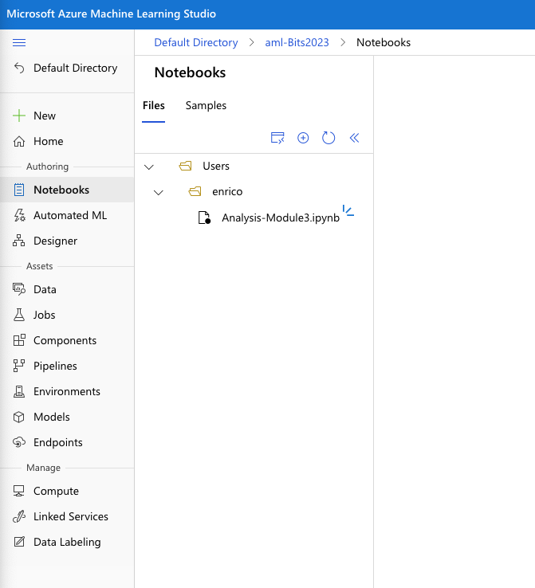

# Applied Data Science with Azure Machine Learning in a day

## Module 3

Module 3 - **Explorative data analysis with Python and notebooks** will dive into exploring approaches to data analysis, statistics and getting the most information and insights from your data. Using the instantiated workspace, attached with compute and datastores, we will be performing univariate, and multivariate statistics, exploring data using Python visualization packages and taking advantage of notebooks.

## Breakdown of Module

1. Log into Azure Portal
2. Go through the notebook
4. Topics:
    * Data Analysis
    * Univariate and multivariate statistics
    * Visualization
    * Model Training

## Notebooks in Azure Machine Learning

Azure Machine Learning allows us to use our compute to run notebooks on.
If you do not yet know what notebooks are, think of them as interactive - web-based - documents in which you can define code blocks to execute. Notebooks are incredibly useful for data analytics and machine learning since it allows us to run blocks of code in a step-by-step manner.

## Running a notebook through Azure Machine Learning Studio
Before we begin exploring our notebook, make sure you followed the steps outlined in module 2. Since notebooks require compute you need to have followed the steps at the end of module 2 to create a compute instance.

To create or open an existing notebook navigate to the `Notebook` option in the side-panel of Azure Machine Learning Studio.

Click on the `Files` button and select `Upload Files`. Inside this material folder of this module we have a pre-made notebook (`Analysis-Module3.ipynb`) which we are going to upload. Navigate to the location material folder of this module and click the `Upload` button to upload the notebook to Azure Machine Learning Studio. Make sure to select the `I trust contents of this file`.

After the notebook is uploaded you can find it in your personal folder in the notebooks view as you can see in the figure below.

Click on the `Analysis-Module3.ipynb` notebook to open it inside Azure Machine Learning Studio.

## Exploring the notebook

As you can see the code blocks inside the notebook each have their own "cell" which you can run separately by clicking on the cell so it is selected and by then pressing the "play" button next to the cell. This will execute the code inside the cell and return results (if there are any) below it.

As you can see not all cells contain code. Inside notebooks we can add pieces of markdown to provide some explanation or describe what we are doing inside the code cells. This is one of the big advantages of notebooks since it allows you to directly document what you are doing together with the code.

All of the code in the example notebook we are using is written in Python. Don't worry if you are not familiar with it, we've explained what each bit of code is doing inside the notebook. Just run through each of cells in the notebook to get yourself familiar with the possibilities.

