# Applied Data Science with Azure Machine Learning in a day

## Module 7

Module 7 - **Using the Designer and Automated ML** goes into more detail on the Designer and Automated ML options inside Azure Machine Learning. We will train a machine learning model, analyze it's performance and ultimately publish it so we can use it to score data from other services.

## Breakdown of Module
1. Using the Designer to create a machine learning model in a low-code manner
2. Deploy a Designer build pipeline
3. Using Automated ML to automatically train machine learning models

## The designer
For those that have been using Azure Machine Learning few years back the Designer will look very familiar. The Designer used to be the main options inside Azure Machine Learning to perform all your analysis or machine learning tasks. While we have far more options available to us now inside Azure Machine Learning Studio the Designer option is still useful when you prefer an easy, accessible and very visual tool to explore your data and build models.

### Creating a new pipeline
Using the Designer we are going to create a new pipeline, add some data to it and train a machine learning model.

To get started click on the `Designer` options inside the Azure Machine Learning Studio sidebar. When the Designer is loaded click on the button `Create a new pipeline using classic prebuild components`. This will create an empty pipeline in which we can drag and drop various components.

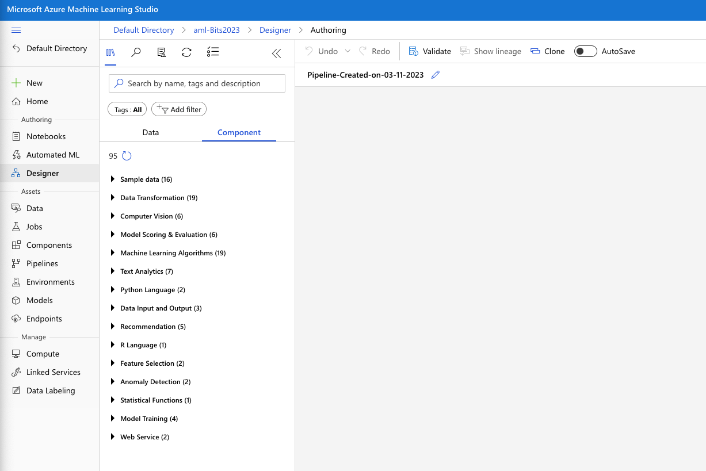

Make sure to select the `Component` tab and open the `Sample data` option. Click on the `Automobile price data (Raw)` dataset and drag it into the canvas so you end up with a canvas as shown in the figure below.

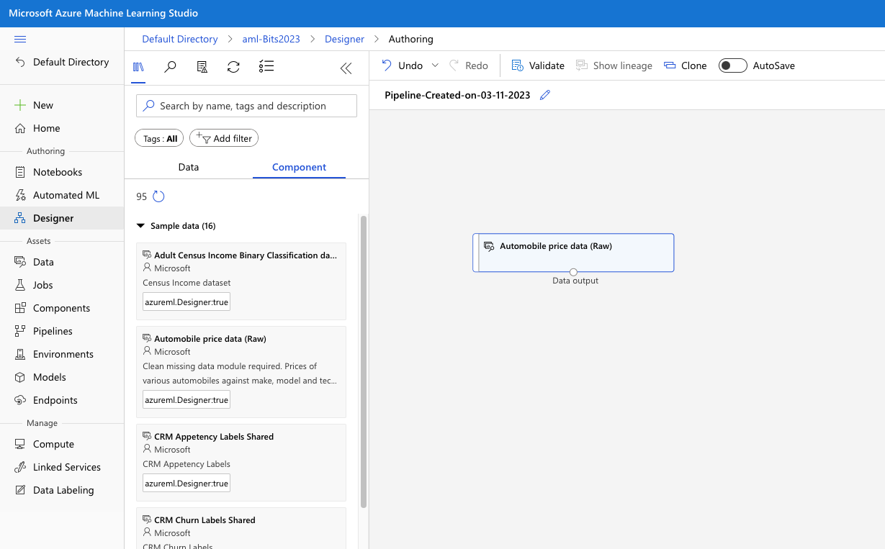

Now that we have some data available to us let's start by looking at the data itself. Right-click on the `Automobile price data (Raw)` element inside the canvas and select the `Preview data` option. This opens a sidebar that shows us all available columns inside the dataset (including a histogram of the data distribution for each column). When selecting a specific column summary statistics are automatically calculated for the selected column as you can see in the figure below. Notice that the entire dataset has a total of 205 rows.

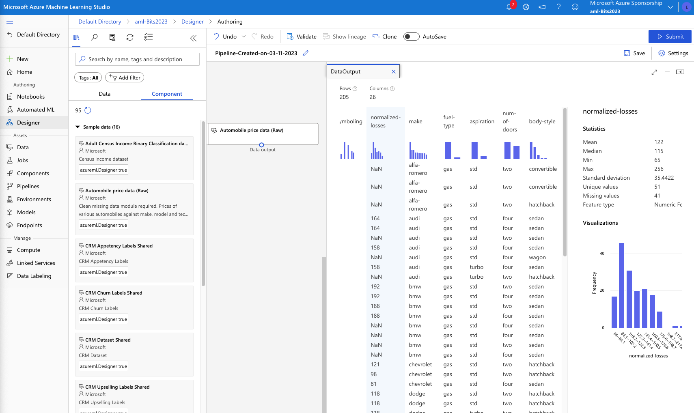

The ability to explore the data is extremely useful to determine how you data is distributed inside the dataset. When exploring the various columns you can see a number of them have missing values. For instance, the `horsepower` column has 2. 

### Cleaning our dataset

To configure how we want to deal with missing values inside our data we can drag another component to the canvas. In this case we can use the `Clean Missing Data` component. You can easily find components using the search bar as shown in the figure below.

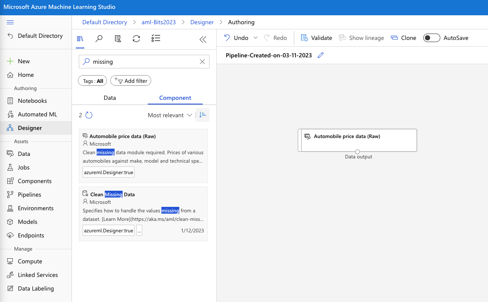

Drag the `Clean Missing Data` component to the canvas underneath the `Automobile price data (Raw)` component. After dragging in the component you can see a warning icon. Hovering over the icon with the mouse tells us "a value is required". Most components will need data going into them before being able to be used. To realize this we need to connect the `Automobile price data (Raw)` component (which is the dataset we are using) to the `Clean Missing Data` component. This is as easy as clicking on the little circle underneath the `Automobile price data (Raw)` component, holding the left mouse button, and dragging the arrow to the `Clean Missing Data` component.

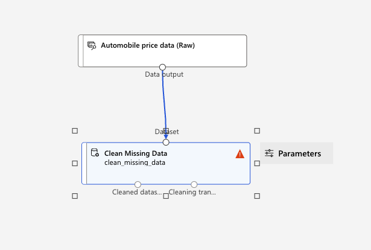

However, even connect both components to each other we still have a warning icon. This is because we haven't actually configured the `Clean Missing Data` component. To view the settings of the component simply double-click on it to open the setting sidebar. In this case we want to remove the entire row whenever we run into a missing value, no matter which column contains the missing value. Select the `All columns` option from the dropdown box and click `Save`.

Under the `Cleaning mode` option select `Remove entire row`. Your `Clean Missing Data` configuration should look like the figure below.

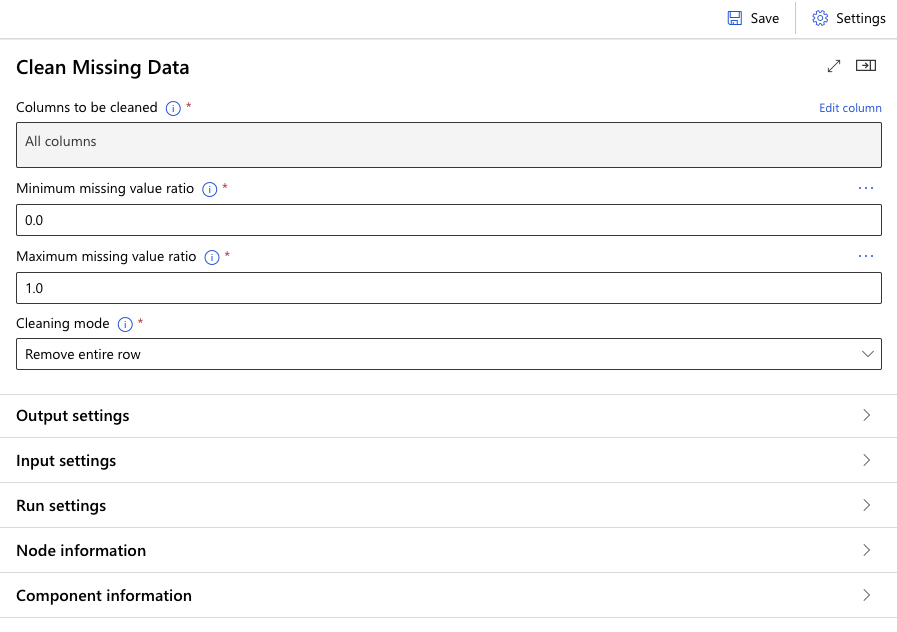

Click on the `Save` button to save the configuration we've set for this component and click on the `Close` button inside the sidebar to return to the canvas.

To actually see the results of our `Clean Missing Data` component we need to run the pipeline. But before we can do that we need to configure the compute instance that will run this pipeline. We can configure this by clicking on the `Settings` option in the top-right of the screen. After opening the settings make sure to set the correct `compute type` and `compute instance`.

Now that we have configured the compute that will run our pipeline we just need to start it. To do this click on the `Submit` button in the top right of the screen.

A pop-up will appear prompting you to select an `Existing experiment`. Since we don't have one yet modify the `Experiment name` option to `Create new` and provide a name for the experiment. After providing a name click on the `Submit` button to start the pipeline.

While the pipeline is running you can click on the `Job detail` text inside the `Submitted jobs` panel to open a new tab to view the progress and results of the pipeline job.

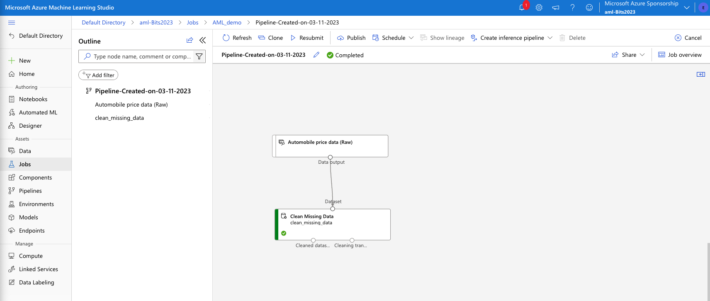

After the pipeline job is completed we can see what the `Clean Missing Data` component actually did for the data that flowed into it. Right-click the `Clean Missing Data` and select `Preview data` and the `Cleaned dataset` option to view our data after the cleaning has been performed. Notice the row amount. The original dataset had 205 rows but our cleaned output has 159. Meaning that we removed 46 rows that had missing values.

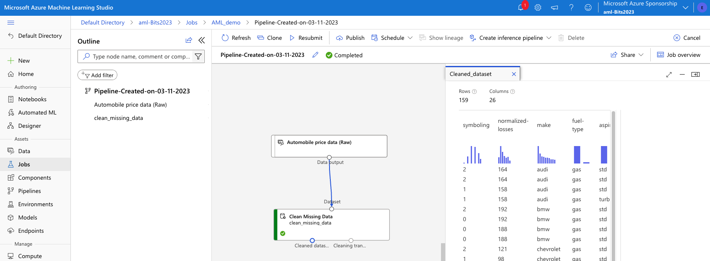

Now that we have a dataset without missing values let's take a look at some other things we can do inside the Designer.

You can close the job detail tab and return to the Designer view.

### Setting correct feature types
Let's add another useful component, the `Edit Metadata` component. Again search for it in the Asset library and drag it into the canvas underneath the `Clean Missing Data` component. Connect the `Cleaned dataset` output to the `Edit Metadata` component. This means that we are only going to use the dataset without the missing values that were processed by the `Clean Missing Data` component. 

Double-click on the `Edit Metadata` component and again use the `Edit columns` option to select to columns we want to process. In this case select the columns: make, fuel-type, aspiration, num-of-doors, body-style, drive-wheels, engine-location, engine-type, num-of-cylinders, fuel-system.

After adding the columns, set the `Data type` to `String` and the `Categorical` option to `Categorical`. These settings will update the selected columns to categorical features which is useful later on when we are going to train a machine learning model on this data.

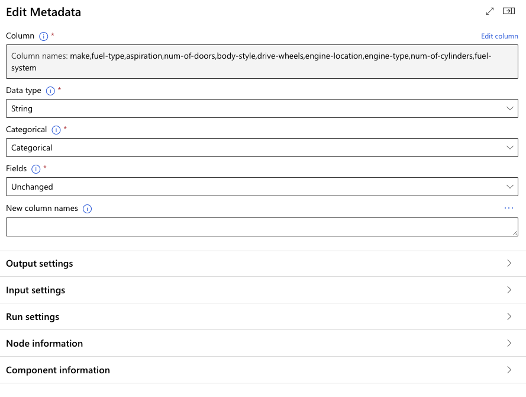

With the `Edit Metadata` component configured, click the `Submit` button again to run the pipeline. In the popup that appears we can now select the `Select existing` option to select the experiment name we created the first time we ran this pipeline.

After submitting the run view the job details. When the job is completed right-click on the `Edit Metadata` component and select `Preview data` and `Results dataset`. Select one of the columns we selected for this component (for instance `Make`) and notice that the Feature type is now set to `Categorical Feature` instead of the original `String Feature`.

Close the job details tab again and return to the Designer view.

### Training a model
Now that we've explored some components that can modify a dataset, let's now look at how we can train a model and analyze it's performance.

The first step we need to take before training and model and evaluation it's performance is to split the data. To do just that search for the `Split Data` component and drag it into the canvas underneath the `Edit Metadata` component. Then connect the `Edit Metadata` component to the `Split Data` component.

Double-click on the `Split Data` component and modify the following settings:

- Fraction of rows in the first output dataset: 0.9
- Random seed: 1234

With these settings we use 90% of the data to train the model and 10% to validate the model's performance after training.

Now search for the `Boosted Decision Tree Regression` component and drag it into the canvas nest to the `Split Data` component.

Search for the `Train Model` component and drag it unto the canvas underneath both the `Boosted Decision Tree Regression` component and the `Split Data` component. Connect the left output of the `Split Data` component (Result dataset 1) to the Dataset input of the `Train Model` component and connect the Untrained model output of the `Boosted Decision Tree Regression` component to the Untrained model input of the `Train Model` component. The figure below shows how each of the components should be connected.

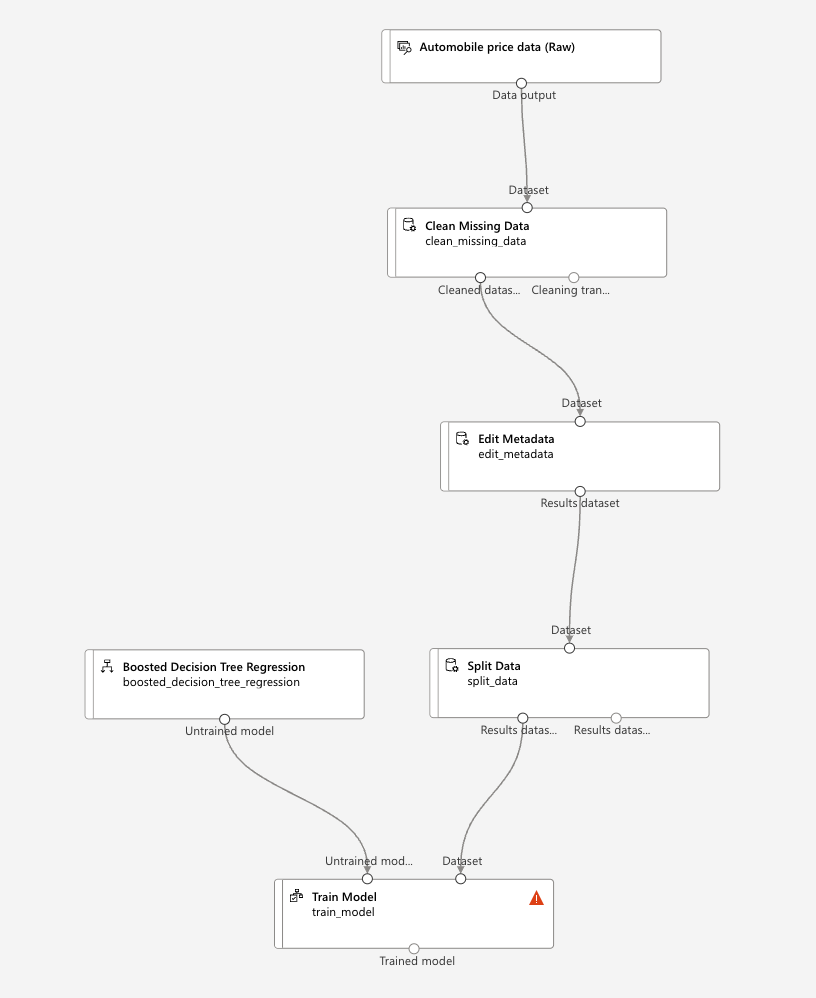

Double-click on the `Train Model` component and click on `Edit column` for the Label column option. Add the `price` column and click on the `Save` button. We are selecting price here since that is the column we want to train the model to predict.

So far we've set everything up needed to train our model. To actually view how the trained model performs we have to add some additional components.

Search for the `Score Model` component and drag it unto the canvas underneath the `Train Model` component. Connect the Trained model output from the `Train Model` component to the left Trained model input of the `Score Model` component. Since we want to evaluate the model's performance we need to give it data it hasn't seen before (aka hasn't been used for the training of the model). Since we've splitted our data we can use the 10% of data we've held back from the training to use for evaluation. Connect the right output of the `Split Data` component (Result dataset 2) to the right input of the `Score Model` component (Dataset).

Finally, search for the `Evaluate Model` component and drag it unto the canvas underneath the `Score Model` component. Connect the output of the `Score Model` component to the left input of the `Evaluate Model` component (Scored dataset). 

After doing all these steps you should end up with a canvas similar to the one shown in the figure below.

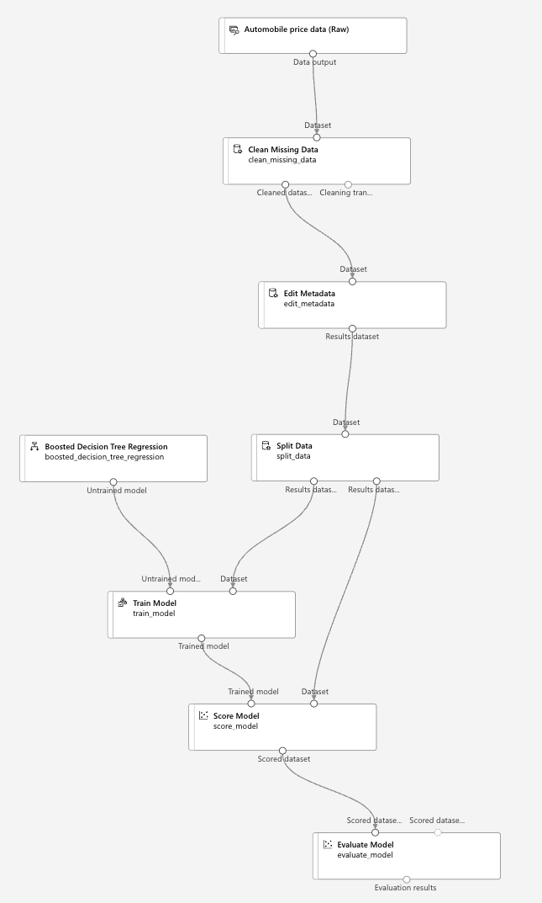

Now that we have everything in place to train, score and evaluate our model we can submit the pipeline for processing. Click on the `Submit` button on the top-right to execute the pipeline.

After the pipeline changed it status to `Running` open the `Job details` so we can see the pipeline job's progress and look at how it performed when it is completed.

### Analyzing model training performance
When our model training pipeline job is completed (all components should be green in the pipeline job overview) we can see how the training performed.

To see the first results right-click on the output of the `Score Model` component (Scored dataset) and select the `Preview` option. This will open a sidebar with the rows that were part of the dataset we used to evaluate the model performance. As you scroll all the way to the right of the dataset you will notice an additional column was added to the dataset: `Scored Labels`. Remember we trained our model to predict the price of a car based on the other columns available in the dataset? The `Scored Labels` column shows the price the model predicted.

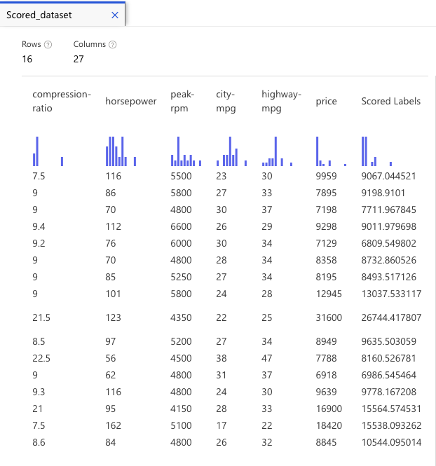

As you can see our model wasn't perfect in predicting the price of a car based on the data it had - if it was that would raise some red flags in terms of how we trained the model - but it wasn't enormously off either. In some cases the price prediction was very close to the actual price. As you can see in the figure above it predicted a car price of **13.037** while the actual price was **12.945** which is pretty close. In other cases however we weren't so close to the actual price.

While we can analyze each of the scored labels and do our own calculations on how the predicted and actual value compare, this doesn't scale very well when using large datasets. In those situations it is far more helpful to look at the training from a statistical perspective.

To do this right-click on the `Evaluate Model` component, select `Preview data` and then `Evaluation results`. This will open a new sidebar with statistical information about the training. Depending on the data and the type of model we use the type of evaluation statistics can be different. Since we've used a regression algorithm we now get statistics like `Mean absolute error`. While each of these statistics help you understand the model performance we will focus on the `Coefficient of determination` one. The coefficient of determination, or R2, is a number between 0 and 1 that shows us how well our model was able to predict an outcome. In this case values close to 0 means it does not predict the outcome very well, while a number of 1 would mean a perfect prediction.
In our case we have a value of 0.93 which means it performed reasonably accurately.

While there are of course many things we can do to optimize the coefficient of determination - for instance tuning the model hyper-parameters - for now we are happy with these results and we want to use this model to perform further price predictions.

### Publishing your pipeline
The first step we need to perform to actually publish our model for scoring is converting it into an inference pipeline. By converting it to an inference pipeline all training components will be automatically removed and we end up with only the components we need to perform our predictions using the model we've trained.

To do this we can use the `Create inference pipeline` button in the top menu of the pipeline run overview. If you've followed the steps so far you should already have these results open, else navigate to the latest job overview by clicking `Jobs` in the side menu and select the experiment you created to run the job in. Then click on the last pipeline run you performed to open the results.

With the pipeline run results open click the `Create inference pipeline` button in the top menu and select the `Real-time inference pipeline` option. This will automatically remove components like `Split data` and `Train model` and add new components like `Webservice input` and `Webservice output`.

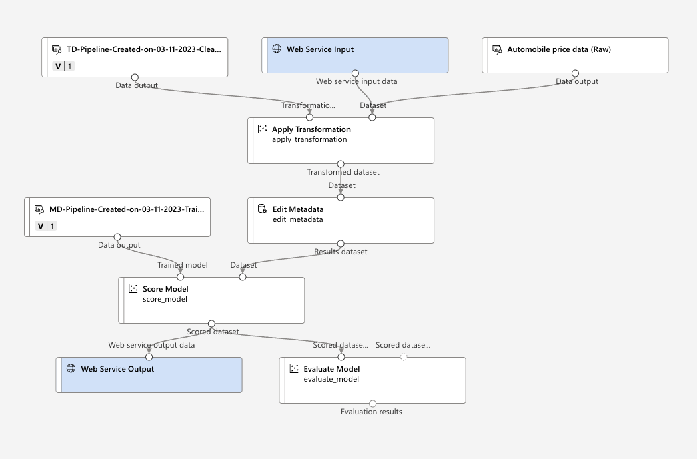

However, to use this pipeline to actually score new data we will have to add an additional component, the `Select columns in Dataset` component.
Since our model is trained on a dataset that already has the column we would like to predict available (in our case the price column), the input of the published pipeline would also expect that column. This is of course unwanted since in many situation we want to model to predict the price and we don't have that column value available when we submit our data to the pipeline endpoint.

Search for the `Select columns in Dataset` component and drag it unto the canvas underneath the `Web Service Input` component. Now remove the lines between the `Web Service Input` component and the `Apply Transformation` component as well as the line between the `Automobile price data (Raw)` and `Apply Transformation` component. 

Delete the `....Clean missing data` and the `Apply Transformation` components and connect the `Select columns in Dataset` component to the `Edit Metadata` component. Finally, delete the `Evaluate model` component.

Your canvas should now look something like the figure below.

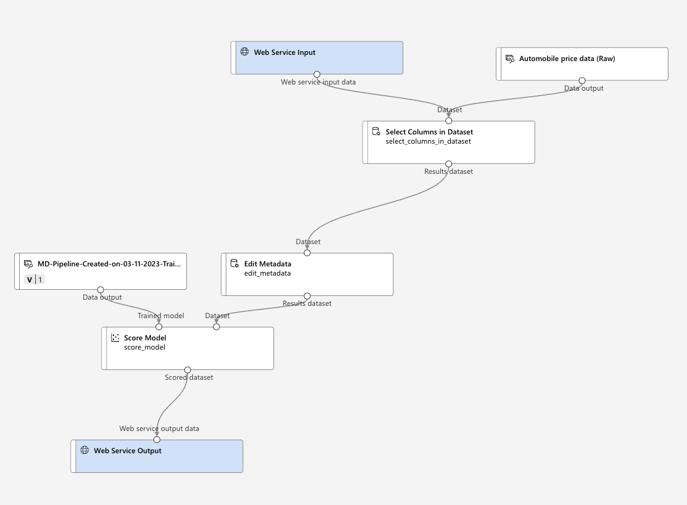

Double-click on the `Select columns in Dataset` component and click on the `Edit column` button to select columns.

Set the first option (include) to `All columns` and click the `+` button to add an extra line. Set the first dropdown box to `Exclude`, the second to `Column names` and add the `price` column.

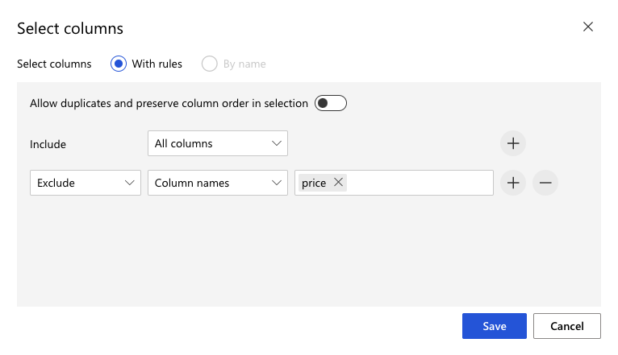

Click `Save` to store the configuration and close the side bar.

### Creating AKS Compute to host the endpoint
Before we can actually deploy our prediction endpoint we have to create an inferencing cluster to host the endpoint.
If you've already created a compute cluster in one of the previous modules we can reuse it, if not follow the steps below to create a compute cluster that can host our endpoint.

Navigate to the `Compute` page by clicking the option in the side bar.
Click on the `Kubernetes clusters` tab and click on the `New` button. Select the `AksCompute` option.

Select the location where you want to deploy the cluster. In our case we select `West Europe`, and select the node size. For now we selected `Standard_A2_v2`. click `Next`.

Provide a Compute name. We don't need to touch the other settings now so click `Create` to deploy the cluster.

### Deploying the inference pipeline
After the cluster is created we can navigate back to our inference pipeline by selecting the `Designer` option in the side menu and selecting the pipeline we created earlier. This should have a Pipeline type of `Real-time inference`.

We now need to submit the pipeline as a job. Click the `Submit` button in the top-right of the screen. After it started running make sure to click the `Job detail` to view the progress. When the job completes successfully we can click the `Deploy` button in the top menu.

After clicking the `Deploy` button we need to provide some information for the endpoint like a name, the compute type and selecting the compute name we want to use to run the endpoint on. For the latter two options you can use compute clusters created earlier or use the AksCompute we created in the previous paragraph. When all is configured hit the `Deploy` button to deploy the endpoint.

It can take a few minutes to deploy the endpoint but when it's done you will receive a notification that the deployment was successful.

Alternatively you can select to deploy the endpoint to an Azure Container Instance. This is great for quickly testing an endpoint but not suitable for production scenario's.

### Accessing the real-time inference endpoint
After deployment of the endpoint is finished we can access it's properties using the `Endpoints` option inside the side menu.

After clicking the option you can select the endpoint we just deployed to open the properties.

In the **Details** tab, you can see more information such as the REST URI, Swagger definition, status, and tags.

In the **Consume tab**, you can find sample consumption code, security keys, and set authentication methods.

In the **Deployment logs** tab, you can find the detailed deployment logs of your real-time endpoint.

To test your endpoint, go to the **Test** tab. From here, you can enter test data and select `Test` to verify the output of your endpoint.

